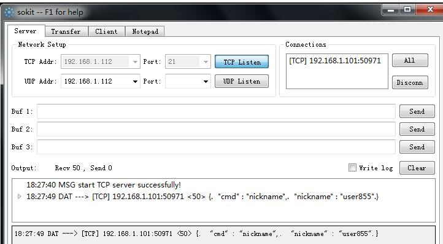

**如何创建项目**
在 Windows Visual Studio 中新建 Visual C++ 控制台应用程序

**Socket是什么**
SOCKET 用于在两个基于 TCP/IP 协议的应用程序之间相互通信。最早出现在 UNIX 系统中，是 UNIX 系统主要的信息传递方式。
在 WINDOWS 系统中，SOCKET 称为 WINSOCK。实际上 SOCKET 是对 TCP/IP  协议的封装，SOCKET 本身并不是协议，而是一个调
用接口(API)。通过 SOCKET，我们才能使用 TCP/IP 协议。实际上，SOCKET 跟 TCP/IP 协议没有必然的联系。SOCKET 编程接口
在设计的时候，就希望也能适应其他的网络协议。所以说，SOCKET 的出现只是使得程序员更方便地使用 TCP/IP 协议栈而已，是
对 TCP/IP 协议的抽象，从而形成了我们知道的一些最基本的函数接口，比如 create、listen、connect、accept、send、read
和write等等。网络有一段关于 SOCKET 和 TCP/IP 协议关系的说法比较容易理解：“TCP/IP 只是一个协议栈，就像操作系统的
运行机制一样，必须要具体实现，同时还要提供对外的操作接口。这个就像操作系统会提供标准的编程接口，比如 win32 编程接
口一样，TCP/IP 也要提供可供程序员做网络开发所用的接口，这就是 SOCKET 编程接口。”

首先要知道的: SOCKET 传输分为输入流(也叫写入流，针对于客户端而言的,来源于服务器端)、输出流(从客户端输出,发送至服务
器端)。

**对于 SOCKET 服务的简单测试，可以采用如下几种方案**
- 1、SocketTest

简介

一个 java 写的 socket 测试工具。它可以创建 TCP 和 UDP 客户端或服务器。它可以用来测试的任何使用 TCP 或 UDP 协议进行通
信的服务器或客户端。由于是 java 写的所以可以跨平台使用。注意：如果是在 MacOS 下使用，开启的监听端口要大于 1024。否则
会报 Permission denied 错误。

[SocketTest](./img/SocketTest.jpg)
 
下载地址：http://sockettest.sourceforge.net/

 
2、sokit

简介

sokit 是一个在 windows 平台下免费的 TCP/UDP 测试（调试）工具， 可以用来接收，发送或转发 TCP/UDP 数据包。
它有三种工作模式： 服务器模式、客户端模式、转发器模式。
支持发送 ascii 字符串数据，以及十六进制表示的原始字节，单次发送的字符数目没有限制；收到的数据会同时以这两种形式显示。

下载地址：http://sokit.soft32.com/

 
- 3、Hercules SETUP utility

简介

同样是一个 windows 平台下的 socket 测试工具。工具包括了串口终端（RS-485 或 RS-232 终端），UDP/IP 终端，TCP/IP 客户或服务器终端。

下载地址：http://www.hw-group.com/products/hercules/index_en.html
