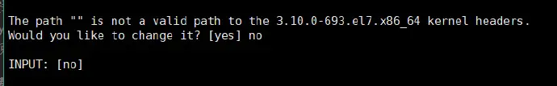
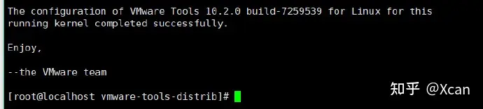
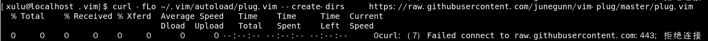

# 使用 CensOS7.9 进行 C/C++ 服务端开发的环境配置


[toc]


> Mac 上使用 VMWare WorkStation 安装 CentOS7.9 的一些参数
>
> 
>
> Mac 宿主机参数
>
>        apples-Mac-mini-1243:Desktop apple$ system_profiler SPHardwareDataType
>         Hardware:
>            Hardware Overview:
>             Model Name: Mac mini
>              Model Identifier: Macmini8,1
>             Processor Name: 6-Core Intel Core i5
>             Processor Speed: 3 GHz
>             Number of Processors: 1
>             Total Number of Cores: 6
>             L2 Cache (per Core): 256 KB
>             L3 Cache: 9 MB
>             Memory: 8 GB
>             System Firmware Version: 1916.40.8.0.0 (iBridge: 20.16.420.0.0,0)
>             OS Loader Version: 564.40.4~27
>             Serial Number (system): xxx
>             Hardware UUID: xxx
>             Provisioning UDID: xxx
>             Activation Lock Status: Enabled
>    
>    
>
> 虚拟机参数
>
> ```
>镜像：            CentOS-7-x86_64-DVD-2009.iso
> 网络模式：         Bridged Networking - Autodetect
> 内存：            4096MB
> 处理器核心数：      2 processor cores
> 磁盘：            20GB
> 语言：            US
> ```


> Windows10 上使用 VMWare WorkStation 安装 CentOS7.9 的一些参数
>
> 
>
> Windows 宿主机参数
>
> ```
>  msinfo32
> 
>    OS Name	Microsoft Windows 10 Pro
>    Version	10.0.19042 Build 19042
>    Other OS Description 	Not Available
>    OS Manufacturer	Microsoft Corporation
>    System Name	LIUSHXIN
>    System Manufacturer	Dell Inc.
>    System Model	Inspiron 7559
>    System Type	x64-based PC
>    System SKU	0706
>    Processor	Intel(R) Core(TM) i5-6300HQ CPU @ 2.30GHz, 2301 Mhz, 4 Core(s), 4 Logical Processor(s)
>    BIOS Version/Date	Dell Inc. 1.2.0, 9/22/2016
>    SMBIOS Version	3.0
>    Embedded Controller Version	255.255
>    BIOS Mode	UEFI
>    BaseBoard Manufacturer	Dell Inc.
>    BaseBoard Product	0H87XC
>    BaseBoard Version	A00
>    Platform Role	Mobile
>    Secure Boot State	On
>    PCR7 Configuration	Elevation Required to View
>    Windows Directory	C:\WINDOWS
>    System Directory	C:\WINDOWS\system32
>    Boot Device	\Device\HarddiskVolume1
>    Locale	China
>    Hardware Abstraction Layer	Version = "10.0.19041.1566"
>    User Name	LIUSHXIN\Administrator
>    Time Zone	China Standard Time
>    Installed Physical Memory (RAM)	12.0 GB
>    Total Physical Memory	11.9 GB
>    Available Physical Memory	4.18 GB
>    Total Virtual Memory	12.6 GB
>    Available Virtual Memory	4.79 GB
>    Page File Space	768 MB
>    Page File	C:\pagefile.sys
>    Kernel DMA Protection	Off
>    Virtualization-based security	Running
>    Virtualization-based security Required Security Properties	
>    Virtualization-based security Available Security Properties	Base Virtualization Support, Secure Boot, DMA Protection
>    Virtualization-based security Services Configured	
>    Virtualization-based security Services Running	
>    Device Encryption Support	Elevation Required to View
>    A hypervisor has been detected. Features required for Hyper-V will not be displayed.	
> ```
>
> 
>
>
> 虚拟机参数
>
> ```
> 镜像：            CentOS-7-x86_64-DVD-2009.iso
> 网络模式：         Bridged
> 内存：            4096MB
> 处理器核心数：      2 processor cores
> 磁盘：            20GB
> 语言：            US
> ```


> 其他前置条件
>
> 
>
> 使用git时可能会出现 “Failed connect to github.com:443; Connection timed out”，此时需要临时设置一下git代理
>
> git config --global http.proxy http://192.168.199.132:7890
> git config --global https.proxy http://192.168.199.132:7890
>
> 
>
> 查看是否设置成功可以使用以下命令
>
> git config --global --get http.proxy
> git config --global --get https.proxy
>
> 
>
> 最后在安装完毕后需要取消代理
>
> git config --global --unset http.proxy 
> git config --global --unset https.proxy

## 一、配置网络环境

CentOS7.9 安装后默认是不联网的，需要通过如下操作开启联网。必须先开启联网然后才能进行其他软件包的安装

```
vi /etc/sysconfig/network-scripts/ifcfg-ens33
```

将 `ONBOOT=no` 改为 `ONBOOT=yes`

然后启动网络服务

```
service network start
```

此时便可以使用 ping 命令或 ip address 来验证


## 二、更新系统中已安装的软件包

### 1. 更新所有可以通过 yum 更新的软件包

```
yum update -y
yum install -y wget nc lsof
```

### 2. 更新 [VMtools](https://so.csdn.net/so/search?q=VMtools&spm=1001.2101.3001.7020) (可选)

主要是为了解决无法在主机和虚拟机之间无法复制粘贴的问题(Windows  直接在 VM > Setting > Options 中操作即可，下面的共享文件夹也是)

- 先检查是否预装了 open-vm-tools 包
  ```
  yum list installed | grep open-vm-*
  ```

- 重新安装前先将 open-vm-tools 包卸载

  ```
  yum remove open-vm-tools
  ```

- 然后确认一下是否卸载成功

  ```
  rpm -qa | grep open-vm-*
  ```

- 紧接着重启系统

  ```
  reboot
  ```

- 重启完成之后， 在 Virtual Machine > Install VMWare tools 处点击安装，点击之后窗口会有提示正在安装 VMware Tools

  - 将CD-ROM挂载到指定目录

    通常情况下都是将设备目录 /dev/cdrom 挂载到 /mnt/cdrom 目录
    如果 /mnt 目录下不存在 cdrom，则自行创建cdrom目录
    创建命令： mkdir -p /mnt/cdrom
    然后进行挂载，命令：mount -t auto /dev/cdrom /mnt/cdrom

  - 拷贝安装包到自己的软件包目录，如 /home

    将上一步所挂载的文件 VMwareTools-10.0.5-3228253.tar.gz，（不同的版本可能文件名不一样）拷贝到 /home
    命令：cp /mnt/cdrom/VMwareTools-10.0.5-3228253.tar.gz /home/
    若提示没有文件权限，则可以修改VMwareTools-10….的文件权限
    使用命令：chmod 755 VMwareTools-10.0.5…. 即可

  - 解除挂载

    至此，我们已经拿到 Vmware tools 的安装包了，所以我们可以解除挂载啦
    命令：umount /dev/cdrom

    注意： 执行此命令时应避免在 /dev/cdrom 下执行，否则会报无法解除挂载

  - 解压安装包
  
    使用命令：tar -zxvf VMwareTools-10.0.5-3228253.tar.gz
    进行解压安装包，记得先切换到 /home 目录

  - 安装 VMware Tools
  
    上面解压后，我们将得到 vmware-tools-distrib 这个目录，cd 进去
    执行安装文件，命令：./vmware-install.pl
    PS：注意命令是 ./ 点开头的
    然后一路Enter即可
    PS：若中途弹出缺少什么的话，就 yum install 安装相关依赖即可，比如 yum install -y perl；

    

    若出现这个情况，那么可以选择 “no”，那么下面会自动创建这个kernel。

    

    当出现这个，就说明安装成功了。
  
    

## 三、设置共享文件夹（可选）

- 在 VMware 软件中设置虚拟机的共享文件夹，比如桌面

  直接虚拟机右键点击“设置”菜单；然后选择“选项”Tab，点击共享文件夹，设置需要共享的本地文件夹即可；
  至此，虚拟机已经通过VMware Tools将本地文件夹共享到 CentOS 系统了，但是 CentOS 还要进行挂载共享文件夹才能读取里面内容

- 挂载共享文件夹到 CentOS 中

上面步骤设置完，重启 CentOS 后会发现共享目录已经挂载到了 /mnt/hgfs

- 为什么要设置共享文件夹

  节省硬盘空间，假如有两台开发电脑都安装了虚拟机，如果设置了共享文件夹，此时硬盘上只需要两个git仓库的副本就以在4台电脑上使用，否则需要4份git仓库的副本


## 四、配置 SSH 

- 安装 openssh-server

  CentOS7.9 默认情况下已经安装了 openssh-server，可用 `yum list installed | grep openssh-server` 查看
  如果没安装可以使用 `yum install openssh-server` 命令安装

- 配置

  ```
  vi /etc/ssh/sshd_config
  ```

  将 Port、ListenAddress、PermitRootLogin、PasswordAuthentication 前面的注释删除

- 开启/重启 openssh-server

  ```
  systemctl restart sshd
  ```

- 使用 ssh 连接此服务器

  ```
  apples-Mac-mini-1243:~ apple$ ssh root@192.168.199.130
  root@192.168.199.130's password:
  Last login: Tue Dec  5 20:44:36 2023 from applesmini1243.lan
  ```

- 可能存在的问题

  - 之前使用 ssh 连接过相同 ip 的虚拟主机（后来虚拟主机删除了又重装），会出现如下错误，如果存在上面的问题，需要从 `/Users/apple/.ssh/known_hosts` 删除相应的记录:

    ```
    apples-Mac-mini-1243:Desktop apple$ ssh root@192.168.199.100
    @@@@@@@@@@@@@@@@@@@@@@@@@@@@@@@@@@@@@@@@@@@@@@@@@@@@@@@@@@@
    @    WARNING: REMOTE HOST IDENTIFICATION HAS CHANGED!     @
    @@@@@@@@@@@@@@@@@@@@@@@@@@@@@@@@@@@@@@@@@@@@@@@@@@@@@@@@@@@
    IT IS POSSIBLE THAT SOMEONE IS DOING SOMETHING NASTY!
    Someone could be eavesdropping on you right now (man-in-the-middle attack)!
    It is also possible that a host key has just been changed.
    The fingerprint for the ED25519 key sent by the remote host is
    SHA256:KJbaxnmIv182s4+0kJ2SzGy3Y/jIn2gWkP/Ubq/BUx8.
    Please contact your system administrator.
    Add correct host key in /Users/apple/.ssh/known_hosts to get rid of this message.
    Offending ED25519 key in /Users/apple/.ssh/known_hosts:14
    Host key for 192.168.199.100 has changed and you have requested strict checking.
    Host key verification failed.
    ```

  - 使用 ssh 连接成功后终端报如下错误

    ```
    -bash: warning: setlocale: LC_CTYPE: cannot change locale (UTF-8): No such file or directory
    ```

    解决方案：

    vi /etc/environment 加入如下代码

    ```
    LC_ALL=zh_CN.utf8
    LANG=zh_CN.utf8 
    ```

    下次 SSH 登陆的时候，就不会出现如上警告了， 而且使用 date 命令会发现已经支持了中文。

  

**安装完成ssh之后，后续的操作就可以通过 ssh 远程操作了**


## 五、安装 Git

直接使用 yum install git 命令安装的 git 版本为 1.8.3.1，版本过低，在安装某些包时会因为不支持某些高级 git 命令而导致安装失败，因此需要安装高版本的 git

- 如果之前使用 yum 命令安装过，可以使用下面的命令卸载

  ```
  yum remove git
  yum remove git-*
  ```

- 在 CentOS7.9 上安装新版本 Git 最快的方法是通过 End Point 库（其他版本的 CentOS 替换成对应版本安装，可参考：packages.endpointdev.com/）

  ```
  yum install -y https://packages.endpointdev.com/rhel/7/os/x86_64/endpoint-repo.x86_64.rpm
  yum install -y git
  ```

- 验证 git 版本

  ```
  git --version
  ```

- 设置git快捷键

  ```
  git config --global color.ui true
  git config --global alias.st status
  git config --global alias.co checkout
  git config --global alias.ci commit
  git config --global alias.br branch
  git config --global alias.unstage 'reset HEAD'
  git config --global alias.last 'log -1'
  git config --global alias.lg "log --color --graph --pretty=format:'%Cred%h%Creset -%C(yellow)%d%Creset %s %Cgreen(%cr) %C(bold blue)<%an>%Creset' --abbrev-commit"
  ```

- 设置git用户

  ```
  git config --global user.name "LShuXin"
  git config --global user.email "1569663570@qq.com"
  ```

  

## 六、使用FTP

  ```
  选用 FileZilla, 协议选择 SFTP
  ```


## 七、 安装新版本(11.2.1)的 gcc、g++

### 一、第一种方式(从未安装过)

在安装之前，可以先去查询一下目前 gcc 、g++ 的版本以及区别，本文用了第11版

#### 1、在系统中安装存储库

```cpp
yum install -y centos-release-scl
```

#### 2、安装 gcc 和 g++ 包（注意版本号：11版）

```cpp
yum install -y devtoolset-11-gcc devtoolset-11-gcc-c++
```

#### 3、配置安装好的包（注意版本号：11版）

```cpp
scl enable devtoolset-11 bash
```

#### 4、验证安装

```cpp
[root@123 /]# gcc -v
Using built-in specs.
COLLECT_GCC=gcc
COLLECT_LTO_WRAPPER=/opt/rh/devtoolset-11/root/usr/libexec/gcc/x86_64-redhat-linux/11/lto-wrapper
Target: x86_64-redhat-linux
Configured with: ../configure --enable-bootstrap --enable-languages=c,c++,fortran,lto --prefix=/opt/rh/devtoolset-11/root/usr --mandir=/opt/rh/devtoolset-11/root/usr/share/man --infodir=/opt/rh/devtoolset-11/root/usr/share/info --with-bugurl=http://bugzilla.redhat.com/bugzilla --enable-shared --enable-threads=posix --enable-checking=release --enable-multilib --with-system-zlib --enable-__cxa_atexit --disable-libunwind-exceptions --enable-gnu-unique-object --enable-linker-build-id --with-gcc-major-version-only --with-linker-hash-style=gnu --with-default-libstdcxx-abi=gcc4-compatible --enable-plugin --enable-initfini-array --with-isl=/builddir/build/BUILD/gcc-11.2.1-20210728/obj-x86_64-redhat-linux/isl-install --enable-gnu-indirect-function --with-tune=generic --with-arch_32=x86-64 --build=x86_64-redhat-linux
Thread model: posix
Supported LTO compression algorithms: zlib
gcc version 11.2.1 20210728 (Red Hat 11.2.1-1) (GCC)
[root@123 /]# g++ -v
Using built-in specs.
COLLECT_GCC=g++
COLLECT_LTO_WRAPPER=/opt/rh/devtoolset-11/root/usr/libexec/gcc/x86_64-redhat-linux/11/lto-wrapper
Target: x86_64-redhat-linux
Configured with: ../configure --enable-bootstrap --enable-languages=c,c++,fortran,lto --prefix=/opt/rh/devtoolset-11/root/usr --mandir=/opt/rh/devtoolset-11/root/usr/share/man --infodir=/opt/rh/devtoolset-11/root/usr/share/info --with-bugurl=http://bugzilla.redhat.com/bugzilla --enable-shared --enable-threads=posix --enable-checking=release --enable-multilib --with-system-zlib --enable-__cxa_atexit --disable-libunwind-exceptions --enable-gnu-unique-object --enable-linker-build-id --with-gcc-major-version-only --with-linker-hash-style=gnu --with-default-libstdcxx-abi=gcc4-compatible --enable-plugin --enable-initfini-array --with-isl=/builddir/build/BUILD/gcc-11.2.1-20210728/obj-x86_64-redhat-linux/isl-install --enable-gnu-indirect-function --with-tune=generic --with-arch_32=x86-64 --build=x86_64-redhat-linux
Thread model: posix
Supported LTO compression algorithms: zlib
gcc version 11.2.1 20210728 (Red Hat 11.2.1-1) (GCC) 
```

#### 5、配置环境变量

> 因为不配置环境变量的话，每打开一个客户端，就需要执行一次上面的第三步配置安装包

```cpp
//先查看gcc和g++安装位置
[root@123 /]# which gcc
/opt/rh/devtoolset-11/root/usr/bin/gcc
[root@123 /]# which g++
/opt/rh/devtoolset-11/root/usr/bin/g++
```

> 编辑文件

```cpp
vi /etc/profile
```

> 在文件后面添加下面两行内容：

```cpp
PATH=$PATH:/opt/rh/devtoolset-11/root/usr/bin
export PATH
```

> 重新加载文件

```cpp
source /etc/profile
```

### 二、第二种方式(使用老版本编译新版本)

#### 1、查看系统中有没有老版本

> 使用 gcc -v 、g++ -v 两个命令查看，如果有，跳到 **3、官网下载想要安装的gcc版本**

#### 2、先用 yum 安装老版本 gcc、g++

```cpp
sudo yum install -y gcc				  // 安装gcc
sudo yum install -y gcc-c++			// 安装g++
```

#### 3、官网下载想要安装的gcc版本

> http://ftp.tsukuba.wide.ad.jp/software/gcc/releases/

#### 4、安装 gcc 需要的其他库

> gmp、mpfr、mpc 三个库编译之前还需准备以下：

**1、安装m4库**

> sudo yum install -y m4 // 首先安装m4，否则 configure gmp 库时会报错

**2、安装以下三个库**

```cpp
 **一定要按照这三个顺序安装**
1、gmp库  		
下载地址：https://gmplib.org/download/gmp/gmp-6.2.1.tar.xz
	tar -Jxvf gmp-6.2.1.tar.xz	//解压
	cd gmp-6.2.1				//进入
	./configure --prefix=/usr  	//指定编译完后要安装的路径，可以自定，示例用/usr
	make -j4					//编译
	sudo make install			//安装
 
2、mpfr库   	
下载地址：https://www.mpfr.org/mpfr-current/mpfr-4.2.0.tar.gz
	tar -zxvf mpfr-4.2.0.tar.gz	//解压
	cd mpfr-4.2.0				//进入
	./configure --prefix=/usr  	//指定编译完后要安装的路径，可以自定，示例用/usr
	make -j4					//编译
	sudo make install			//安装
	
3、mpc库   	
下载地址：https://mirrors.aliyun.com/gnu/mpc/mpc-1.3.1.tar.gz?spm=a2c6h.25603864.0.0.60dd1a8cVMdT9B	
	tar -zxvf mpc-1.3.1.tar.gz	//解压
	cd 	mpc-1.3.1				//进入
	./configure --prefix=/usr  	//指定编译完后要安装的路径，可以自定，示例用/usr
	make -j4					//编译
	sudo make install			//安装
```

#### 5、编译安装 gcc、g++

> 编译 gcc 时需要 cc1，系统中会有，但是编译时会报错找不到

先到根目录下找：

```cpp
cd /
sudo find -name cc1
```

> 我的cc1在 /usr/libexec/gcc/x86_64-redhat-linux/4.8.2/cc1

创建软连接到/usr/bin目录下

```cpp
sudo ln -s /usr/libexec/gcc/x86_64-redhat-linux/4.8.2/cc1 /usr/bin/cc1
```

> 编译过程中可能会遇到这个错误，找不到**libmpfr.so.6** 这个库，但是系统中会有，所以要先创建一个软连接


> 去根目录查找

```cpp
cd /
sudo find -name libmpfr.so.6 
```

> 我的这个文件在/usr/lib目录下

在编译前先创建一个软连接到/usr/lib64目录下

```cpp
sudo ln -s /usr/lib/libmpfr.so.6 /usr/lib64/libmpfr.so.6	//这个软连接一定要创建在/usr/lib64目录下
```

**编译安装 gcc、g++**

```cpp
tar -zxvf gcc-12.2.0.tar.gz 	//解压
cd gcc-12.2.0/					//进入
sudo ./configure --disable-multilib --prefix=/usr		
								//生成makefile，--prefix指定编译完之后的安装路径
								// /usr表示安装之后的gcc、g++在/usr/bin里面
								//如果路径中有CMakeLists.txt，则也可以使用cmake生成makefile
								//cmake . -G "Unix Makefiles" -DCMAKE_INSTALL_PREFIX=/usr
								//--enable-multilib 允许32位编译，如果系统中有32位的环境，一般不需要
								//--disable-multilib 只使用64位编译
sudo make -j4					//编译
```

在执行sudo make -j4时，我这里出现了一个报错


> 这是由于在编译时内存不足造成的，
> 1、如果是虚拟机，可以扩大虚拟机的内存
> 2、创建swap分区（推荐）
> 建议看这篇文章https://blog.csdn.net/weixin_44796670/article/details/121234446
> 之后再执行sudo make -j4
> 编译安装完之后根据链接文章删除swap分区即可
>
> 3、或者将sudo make -j4改为sudo make，减少同时进行的任务数量，但是编译时间会更长

等待编译完成，时间比较长！！！

#### 6、删除创建的软连接，卸载 yum 安装的 gcc、g++

```cpp
//删除创建的软连接
sudo rm -rf /usr/bin/cc1
sudo rm -rf /usr/lib64/libmpfr.so.6
 
//卸载yum安装的gcc、g++
sudo yum remove gcc gcc-c++
sudo make install				//gcc和g++安装到/usr/bin目录中了
```


## 八、安装新版本(3.28)的CMake

### 1. 安装 openssl

```
yum install -y zlib zlib-devel bzip2-devel openssl-devel ncurses-devel sqlite-devel readline-devel tk-devel libffi-devel  libncurses-dev

cd /home
wget http://www.openssl.org/source/openssl-1.1.1.tar.gz 
tar -zxvf openssl-1.1.1.tar.gz 
cd openssl-1.1.1
./config --prefix=/usr/local/openssl shared zlib
make && make install
echo "export LD_LIBRARY_PATH=$LD_LIBRARY_PATH:/usr/local/openssl/lib" >>  /etc/profile
source /etc/profile 
```

### 2. 下载CMake

```
cd /home
wget https://cmake.org/files/v3.28/cmake-3.28.0.tar.gz
```

### 2. 编译安装

```
tar zxvf cmake-3.*
cd cmake-3.*
./bootstrap --prefix=/usr/local
make -j$(nproc)
make install
```

### 3. 验证

```
cmake --version

cmake version *.*.*
CMake suite maintained and supported by Kitware (kitware.com/cmake).
```


## 九、安装gdb

直接使用 yum 安装

```
 yum install -y gdb
 
 [root@localhost ~]# gdb --version
GNU gdb (GDB) Red Hat Enterprise Linux 7.6.1-120.el7
Copyright (C) 2013 Free Software Foundation, Inc.
License GPLv3+: GNU GPL version 3 or later <http://gnu.org/licenses/gpl.html>
This is free software: you are free to change and redistribute it.
There is NO WARRANTY, to the extent permitted by law.  Type "show copying"
and "show warranty" for details.
This GDB was configured as "x86_64-redhat-linux-gnu".
For bug reporting instructions, please see:
<http://www.gnu.org/software/gdb/bugs/>.
```


## 十、安装 vim、 配置 C/C++ 开发环境

> 使用 Vim + Vundle 来配置 C/C++ 开发环境
>
> 
>
> CentOS7.9 系统默认 python 版本为 2.7.5，直接使用 yum install vim-enhanced 安装的 vim 版本为 2:7.4.629-8.el7_9，且由于最新版本的 vim(9.x) 需要 python3.8+，所以这里会先安装 python3.8
>
> 
>
> python3.8 安装完成后，先备份原始 python： mv /usr/bin/python /usr/bin/python.bak
>
> 然后新建 python3 软链接：ln -s /usr/local/python3/bin/python3 /usr/bin/python
>
> 此时系统python版本已经是python3了
>
> 
>
> 如果想将系统 python 版本还原，可以运行： 
>
> mv /usr/bin/python.bak /usr/bin/python 
>
> 
>
> 特别注意
>
> 系统版本如果不还原为原来的 2.7.x 版本的话无法运行yum命令

### 1. 安装 Python3.8

- 安装 Python3.8

  ```
  cd /home
  wget https://www.python.org/ftp/python/3.8.1/Python-3.8.1.tgz
  tar -zxvf Python-3.8.1.tgz
  cd Python-3.8.1
  ./configure --prefix=/usr/local/python3 --with-openssl=/usr/local/openssl --enable-optimizations --enable-shared
  make -j 6 && make install
  ```

- 备份系统python

  ```
  mv /usr/bin/python /usr/bin/python.bak
  ```

- 新建软链接将系统python版本改为3.8

  ```
  ln -s /usr/local/python3/bin/python3 /usr/bin/python
  ```

- 验证

  ```
  [root@localhost ~]# python --version
  python: error while loading shared libraries: libpython3.8.so.1.0: cannot open shared object file: No such file or directory
  ```

  此时需要找到so库并且拷贝到指定位置

  ```
  [root@localhost home]# find / -name libpython3.8.so.1.0
  /usr/local/python3/lib/libpython3.8.so.1.0
  /home/Python-3.8.1/libpython3.8.so.1.0
  [root@localhost home]# cp /usr/local/python3/lib/libpython3.8.so.1.0 /usr/lib64/
  [root@localhost home]# python --version
  Python 3.8.1
  ```

### 2. 编译安装最新 Vim

1. 下载
  ```
  cd /home
  git clone https://github.com/vim/vim.git
  cd vim
  git checkout v9.0.2167
  ```

2. 解压编译
  ```
  export LDFLAGS="-rdynamic"
  ./configure --enable-python3interp=yes --with-python3-command=python
  make -j 6 && make install
  ```

3. 配置环境变量
   上述安装完成的 vim 存在于 /usr/local/bin 文件夹中, 将此路径加入 $PATH

   ```
   vi ~/.bash_profile
   ```

   ```
   PATH=$PATH:/usr/local/bin
   ```

   ```
   source ~/.bash_profile
   ```

4. 验证安装

  ```
  [root@localhost vim]# vim --version
  VIM - Vi IMproved 9.0 (2022 Jun 28, 编译于 Dec 14 2023 19:03:30)
  包含补丁: 1-2167
  编译者 root@localhost.localdomain
  巨型版本 无图形界面。  可使用(+)与不可使用(-)的功能:
  +acl               +file_in_path      +mouse_urxvt       -tag_any_white
  +arabic            +find_in_path      +mouse_xterm       -tcl
  +autocmd           +float             +multi_byte        +termguicolors
  +autochdir         +folding           +multi_lang        +terminal
  -autoservername    -footer            -mzscheme          +terminfo
  -balloon_eval      +fork()            +netbeans_intg     +termresponse
  +balloon_eval_term +gettext           +num64             +textobjects
  -browse            -hangul_input      +packages          +textprop
  ++builtin_terms    +iconv             +path_extra        +timers
  +byte_offset       +insert_expand     -perl              +title
  +channel           +ipv6              +persistent_undo   -toolbar
  +cindent           +job               +popupwin          +user_commands
  -clientserver      +jumplist          +postscript        +vartabs
  -clipboard         +keymap            +printer           +vertsplit
  +cmdline_compl     +lambda            +profile           +vim9script
  +cmdline_hist      +langmap           -python            +viminfo
  +cmdline_info      +libcall           +python3           +virtualedit
  +comments          +linebreak         +quickfix          +visual
  +conceal           +lispindent        +reltime           +visualextra
  +cryptv            +listcmds          +rightleft         +vreplace
  +cscope            +localmap          -ruby              +wildignore
  +cursorbind        -lua               +scrollbind        +wildmenu
  +cursorshape       +menu              +signs             +windows
  +dialog_con        +mksession         +smartindent       +writebackup
  +diff              +modify_fname      -sodium            -X11
  +digraphs          +mouse             -sound             +xattr
  -dnd               -mouseshape        +spell             -xfontset
  -ebcdic            +mouse_dec         +startuptime       -xim
  +emacs_tags        -mouse_gpm         +statusline        -xpm
  +eval              -mouse_jsbterm     -sun_workshop      -xsmp
  +ex_extra          +mouse_netterm     +syntax            -xterm_clipboard
  +extra_search      +mouse_sgr         +tag_binary        -xterm_save
  -farsi             -mouse_sysmouse    -tag_old_static
       系统 vimrc 文件: "$VIM/vimrc"
       用户 vimrc 文件: "$HOME/.vimrc"
   第二用户 vimrc 文件: "~/.vim/vimrc"
        用户 exrc 文件: "$HOME/.exrc"
         defaults 文件: "$VIMRUNTIME/defaults.vim"
           $VIM 预设值: "/usr/local/share/vim"
  编译方式: gcc -c -I. -Iproto -DHAVE_CONFIG_H -g -O2 -D_REENTRANT -U_FORTIFY_SOURCE -D_FORTIFY_SOURCE=1
  链接方式: gcc -rdynamic -L/usr/local/lib -Wl,--as-needed -o vim -lm -ltinfo -lselinux -lrt -ldl -L/usr/local/python3/lib/python3.8/config-3.8-x86_64-linux-gnu -lpython3.8 -lcrypt -lpthread -ldl -lutil -lm -lm
  ```


### 3. 安装 Vim 包管理工具 [Vundle](http://github.com/VundleVim/Vundle.vim)

其实也可以使用 [vim-plug](https://github.com/junegunn/vim-plug) 来管理插件，这里在安装  [YouCompleteMe](https://github.com/ycm-core/YouCompleteMe) 插件时推荐使用 [Vundle](http://github.com/VundleVim/Vundle.vim) 来安装，因此就选择了采用  [Vundle](http://github.com/VundleVim/Vundle.vim)  做为 vim 的包管理工具

安装步骤参考：https://github.com/VundleVim/Vundle.vim

```
git clone https://github.com/VundleVim/Vundle.vim.git ~/.vim/bundle/Vundle.vim
```

安装完成后需要配置 vim，配置文件位于 `~/.vimrc`, 下面为示例配置文件，配置文件编辑完成后，执行 vim 、:PluginInstall

```
set nocompatible              " be iMproved, required
filetype off                  " required

set rtp+=~/.vim/bundle/Vundle.vim

call vundle#begin()
Plugin 'VundleVim/Vundle.vim'
"Plugin 'Valloric/YouCompleteMe'
"Plugin 'tpope/vim-fugitive'
"Plugin 'tpope/vim-surround'
"Plugin 'scrooloose/nerdtree'
"Plugin 'kana/vim-operator-user'
"Plugin 'flazz/vim-colorschemes'
"Plugin 'octol/vim-cpp-enhanced-highlight'
"Plugin 'rip-rip/clang_complete'
"Plugin 'vim-syntastic/syntastic'
"Plugin 'sjl/badwolf'
call vundle#end()

filetype plugin indent on

set autoread
au FocusGained,BufEnter * checktime

" Set mapleader to , so you can use commands with that key
let mapleader = ","
" Save the file with ,w
nmap <leader>w :w!<cr>
set so=7
set wildmenu
set wildignore=*.o,*~,*.pyc,.git\*
set ruler
set cmdheight=1
set hid
set backspace=eol,start,indent
set whichwrap+=<,>,h,l
set ignorecase
set hlsearch
set incsearch
set lazyredraw
set magic
set showmatch
set mat=2
set number
set foldcolumn=1
set scrolloff=2

syntax enable
set background=dark
set encoding=utf8
set ffs=unix,dos,mac

set nobackup
set nowb
set noswapfile

set expandtab
set smarttab
set shiftwidth=2
set tabstop=2

set lbr
set tw=500

set ai
set si
set wrap

" Visual mode pressing * or # searches for the current selection
" Super useful! From an idea by Michael Naumann
vnoremap <silent> * :<C-u>call VisualSelection('', '')<CR>/<C-R>=@/<CR><CR>
vnoremap <silent> # :<C-u>call VisualSelection('', '')<CR>?<C-R>=@/<CR><CR>

" Disable highlight when <leader><cr> is pressed
map <silent> <leader><cr> :noh<cr>

" Useful mappings for managing tabs
map <leader>tn :tabnew<cr>
map <leader>to :tabonly<cr>
map <leader>tc :tabclose<cr>
map <leader>tm :tabmove
map <leader>t<leader> :tabnext

" Opens a new tab with the current buffer's path
" Super useful when editing files in the same directory
map <leader>te :tabedit <C-r>=expand("%:p:h")<cr>/

" Switch CWD to the directory of the open buffer
map <leader>cd :cd %:p:h<cr>:pwd<cr>

" Specify the behavior when switching between buffers
try
  set switchbuf=useopen,usetab,newtab
  set stal=2
catch
endtry

" Return to last edit position when opening files (You want this!)
au BufReadPost * if line("'\"") > 1 && line("'\"") <= line("$") | exe "normal! g'\"" | endif

" Always show the status line
set laststatus=2

" Format the status line
set statusline=\ %{HasPaste()}%F%m%r%h\ %w\ \ CWD:\ %r%{getcwd()}%h\ \ \ Line:\ %l\ \ Column:\ %c

" Remap VIM 0 to first non-blank character
map 0 ^

" Delete trailing white space on save, useful for some filetypes ;)
fun! CleanExtraSpaces()
  let save_cursor = getpos(".")
  let old_query = getreg('/')
  silent! %s/\s\+$//e
  call setpos('.', save_cursor)
  call setreg('/', old_query)
endfun

if has("autocmd")
  autocmd BufWritePre *.txt,*.js,*.py,*.wiki,*.sh,*.coffee :call CleanExtraSpaces()
endif

" Pressing ,ss will toggle and untoggle spell check
map <leader>ss :setlocal spell!<cr>

" Shortcuts
map <leader>sn ]s
map <leader>sp [s
map <leader>sa zg
map <leader>s? z=

" Returns true if paste mode is enabled
function! HasPaste()
  if &paste
    return 'PASTE MODE '
  endif
  return ''
endfunction

command! Bclose call <SID>BufcloseCloseIt()
function! <SID>BufcloseCloseIt()
  let l:currentBufNum = bufnr("%")
  let l:alternateBufNum = bufnr("#")

  if buflisted(l:alternateBufNum)
    buffer #
  else
    bnext
  endif

  if bufnr("%") == l:currentBufNum
    new
  endif

  if buflisted(l:currentBufNum)
    execute("bdelete! ".l:currentBufNum)
  endif
endfunction

function! CmdLine(str)
  call feedkeys(":" . a:str)
endfunction

function! VisualSelection(direction, extra_filter) range
  let l:saved_reg = @"
  execute "normal! vgvy"

  let l:pattern = escape(@", "\\/.*'$^~[]")
  let l:pattern = substitute(l:pattern, "\n$", "", "")

  if a:direction == 'gv'
    call CmdLine("Ack '" . l:pattern . "' " )
  elseif a:direction == 'replace'
    call CmdLine("%s" . '/'. l:pattern . '/')
  endif

  let @/ = l:pattern
  let @" = l:saved_reg
endfunction

map <F2> :w<CR>

" C/C++ config
" Switch between header/source
autocmd FileType cpp map <F4> :e %:p:s,.hpp$,.X123X,:s,.cpp$,.hpp,:s,.X123X$,.cpp,<CR>
autocmd FileType c map <F4> :e %:p:s,.h$,.X123X,:s,.c$,.h,:s,.X123X$,.c,<CR>
" Regenrate tags file with F5
map <F5> :!ctags -R .<CR>
" Goto definition with F12
map <F12> <C-]>

" Clang-complete
let g:clang_library_path='/usr/lib/llvm-7/lib/libclang.so.1'
autocmd FileType c,cpp set omnifunc=ClangComplete
autocmd FileType c,cpp set completefunc=ClangComplete
imap <C-Space> <C-X><C-O>
imap <C-@> <C-Space>

" Color scheme
"colorscheme badwolf

" NerdTree
map <F10> :NERDTreeToggle<CR>

" Open new file in a tab
map <F3> :tabedit<Space>

" Ctrl+Backspace deletes a word
noremap! <C-BS> <C-w>
noremap! <C-h> <C-w>

inoremap { {}<Left>
inoremap {<CR> {<CR>}<Esc>O
inoremap {{ {
inoremap {} {}

" Syntastic
set statusline+=\ %#warningmsg#
"set statusline+=%{SyntasticStatuslineFlag()}
set statusline+=%*

let g:syntastic_always_populate_loc_list = 1
let g:syntastic_auto_loc_list = 1
let g:syntastic_check_on_open = 1
let g:syntastic_check_on_wq = 0
let g:syntastic_cpp_config_file=".clang_complete"
let g:syntastic_cpp_check_header = 1

let completeopt = "longest,noinsert,menu,preview"
```


### 4. 安装 Valloric/YouCompleteMe(未完成)

解开上述配置文件中注释掉的 Valloric/YouCompleteMe， 然后运行：

```
vim
:PluginInstall
```

不出意外会出现

```
The ycmd server SHUT DOWN (restart with ':YcmRestartServer'). YCM core library not det... you need to compile YCM before using it. Follow the instructions in the documentation.
```

解决方案为

- 首先运行

  ```
  cd ~/.vim/bundle/YouCompleteMe
  python ./install.py --clang-completer --force-sudo
  
  
  以下是超时后的输出
  -- Performing Test CMAKE_HAVE_LIBC_PTHREAD
  -- Performing Test CMAKE_HAVE_LIBC_PTHREAD - Failed
  -- Looking for pthread_create in pthreads
  -- Looking for pthread_create in pthreads - not found
  -- Looking for pthread_create in pthread
  -- Looking for pthread_create in pthread - found
  -- Found Threads: TRUE
  -- Downloading libclang 17.0.1 from https://github.com/ycm-core/llvm/releases/download/17.0.1/libclang-17.0.1-x86_64-unknown-linux-gnu.tar.bz2
  CMake Error at ycm/CMakeLists.txt:101 (file):
    file DOWNLOAD cannot compute hash on failed download
  
      status: [28;"Timeout was reached"]
  
  
  CMake Error at ycm/CMakeLists.txt:117 (message):
    Cannot find path to libclang in prebuilt binaries
  
  
  -- Configuring incomplete, errors occurred!
  
  FAILED
  
  ERROR: the build failed.
  
  NOTE: it is *highly* unlikely that this is a bug but rather that this is a problem with the configuration of your system or a missing dependency. Please carefully read CONTRIBUTING.md and if you're sure that it is a bug, please raise an issue on the issue tracker, including the entire output of this script (with --verbose) and the invocation line used to run it.
  
  The installation failed; please see above for the actual error. In order to get more information, please re-run the command, adding the --verbose flag. If you think this is a bug and you raise an issue, you MUST include the *full verbose* output.
  
  For example, run:/usr/bin/python /root/.vim/bundle/YouCompleteMe/third_party/ycmd/build.py --clang-completer --force-sudo --verbose
  ```

- 等上述命令超时后，运行如下命令

  ```
  [root@localhost YouCompleteMe]# cd ~/.vim/bundle/YouCompleteMe/third_party/ycmd/clang_archives
  [root@localhost clang_archives]# ls
  libclang-17.0.1-x86_64-unknown-linux-gnu.tar.bz2
  [root@localhost clang_archives]# rm libclang-17.0.1-x86_64-unknown-linux-gnu.tar.bz2
  ```

- 手动下载 https://github.com/ycm-core/llvm/releases/download/17.0.1/libclang-17.0.1-x86_64-unknown-linux-gnu.tar.bz2，并使用ftp上传到 ~/.vim/bundle/YouCompleteMe/third_party/ycmd/clang_archives 目录

- 然后重新运行

  ```
  cd ~/.vim/bundle/YouCompleteMe
  python ./install.py --clang-completer --system-libclang --no-regex --force-sudo
  
  以下是运行成功的输出
  [root@localhost YouCompleteMe]# python ./install.py --clang-completer --force-sudo
  Forcing build with root privileges. If it breaks, keep the pieces.
  Generating ycmd build configuration...OK
  Compiling ycmd target: ycm_core...OK
  Building regex module...OK
  Building watchdog module...OK
  [root@localhost YouCompleteMe]#
  ```

- 运行成功后，再次运行 vim 命令, 有如下报错

  ```
  The ycmd server SHUT DOWN (restart with ':YcmRestartServer'). Unexpected error while l...M core library. Type ':YcmToggleLogs ycmd_41383_stderr_2ln6pzld.log' to check the logs.ycm
  ```

  在 /tmp 目录中查看日志，关键信息为

  ```
  2023-12-14 19:27:14,930 - ERROR - /lib64/libm.so.6: version `GLIBC_2.29' not found (required by /root/.vim/bundle/YouCompleteMe/third_party/ycmd/cpp/../third_party/clang/lib/libclang.so.17)
  ```

  继续查看系统中的 GLIBC, 发现确实没有

  ```
  [root@localhost lib]# strings /usr/lib64/libc.so.6 | grep GLIBC
  GLIBC_2.2.5
  GLIBC_2.2.6
  GLIBC_2.3
  GLIBC_2.3.2
  GLIBC_2.3.3
  GLIBC_2.3.4
  GLIBC_2.4
  GLIBC_2.5
  GLIBC_2.6
  GLIBC_2.7
  GLIBC_2.8
  GLIBC_2.9
  GLIBC_2.10
  GLIBC_2.11
  GLIBC_2.12
  GLIBC_2.13
  GLIBC_2.14
  GLIBC_2.15
  GLIBC_2.16
  GLIBC_2.17
  GLIBC_PRIVATE
  ___sys_nerr_GLIBC_2_3
  ___sys_nerr_GLIBC_2_4
  ___sys_nerr_GLIBC_2_1
  ___sys_errlist_GLIBC_2_1
  ___sys_errlist_GLIBC_2_4
  ___sys_errlist_GLIBC_2_3
  _IO_file_seekoff@@GLIBC_2.2.5
  getservent_r@@GLIBC_2.2.5
  _sys_siglist@@GLIBC_2.3.3
  _dl_starting_up@@GLIBC_PRIVATE
  tmpfile@@GLIBC_2.2.5
  sched_getaffinity@GLIBC_2.3.3
  pthread_cond_wait@GLIBC_2.2.5
  regexec@GLIBC_2.2.5
  memcpy@@GLIBC_2.14
  _IO_file_init@@GLIBC_2.2.5
  realpath@GLIBC_2.2.5
  realpath@@GLIBC_2.3
  __ctype32_tolower@GLIBC_2.2.5
  gethostbyname2_r@@GLIBC_2.2.5
  getaliasbyname_r@@GLIBC_2.2.5
  _IO_file_overflow@@GLIBC_2.2.5
  pthread_cond_wait@@GLIBC_2.3.2
  getprotoent_r@@GLIBC_2.2.5
  regexec@@GLIBC_2.3.4
  _rtld_global@@GLIBC_PRIVATE
  getgrgid_r@@GLIBC_2.2.5
  pthread_cond_init@GLIBC_2.2.5
  _IO_fsetpos@@GLIBC_2.2.5
  GLIBC_2.8
  _IO_proc_close@@GLIBC_2.2.5
  _sys_nerr@@GLIBC_2.12
  pthread_cond_timedwait@@GLIBC_2.3.2
  __libc_enable_secure@@GLIBC_PRIVATE
  pclose@@GLIBC_2.2.5
  getaliasent_r@@GLIBC_2.2.5
  __tls_get_addr@@GLIBC_2.3
  _sys_nerr@GLIBC_2.4
  sys_sigabbrev@GLIBC_2.2.5
  pthread_cond_broadcast@GLIBC_2.2.5
  _IO_proc_open@@GLIBC_2.2.5
  posix_spawn@@GLIBC_2.15
  getpwnam_r@@GLIBC_2.2.5
  _rtld_global_ro@@GLIBC_PRIVATE
  getrpcbyname_r@@GLIBC_2.2.5
  pthread_cond_broadcast@@GLIBC_2.3.2
  nftw64@GLIBC_2.2.5
  _sys_siglist@GLIBC_2.2.5
  _sys_nerr@GLIBC_2.3
  _IO_fsetpos64@@GLIBC_2.2.5
  __ctype_tolower@GLIBC_2.2.5
  __ctype_toupper@GLIBC_2.2.5
  _IO_file_underflow@@GLIBC_2.2.5
  localeconv@@GLIBC_2.2.5
  pthread_cond_timedwait@GLIBC_2.2.5
  _IO_file_fopen@@GLIBC_2.2.5
  __ctype_b@GLIBC_2.2.5
  GLIBC_2.5
  _IO_file_finish@@GLIBC_2.2.5
  GLIBC_2.9
  getgrnam_r@@GLIBC_2.2.5
  GLIBC_2.7
  GLIBC_2.6
  getservbyname_r@@GLIBC_2.2.5
  __ctype32_b@GLIBC_2.2.5
  _res@GLIBC_2.2.5
  __secure_getenv@GLIBC_2.2.5
  getnetent_r@@GLIBC_2.2.5
  nftw@GLIBC_2.2.5
  getpwuid_r@@GLIBC_2.2.5
  _IO_fdopen@@GLIBC_2.2.5
  posix_spawn@GLIBC_2.2.5
  gethostbyaddr_r@@GLIBC_2.2.5
  _IO_file_xsputn@@GLIBC_2.2.5
  pthread_attr_init@@GLIBC_2.2.5
  getrpcbynumber_r@@GLIBC_2.2.5
  _IO_fopen@@GLIBC_2.2.5
  getnetbyname_r@@GLIBC_2.2.5
  memcpy@GLIBC_2.2.5
  pthread_cond_signal@@GLIBC_2.3.2
  pthread_cond_signal@GLIBC_2.2.5
  sys_sigabbrev@@GLIBC_2.3.3
  _IO_fgetpos@@GLIBC_2.2.5
  posix_spawnp@@GLIBC_2.15
  _IO_file_setbuf@@GLIBC_2.2.5
  getservbyport_r@@GLIBC_2.2.5
  _sys_errlist@GLIBC_2.3
  _IO_file_attach@@GLIBC_2.2.5
  gethostent_r@@GLIBC_2.2.5
  _sys_errlist@GLIBC_2.4
  _sys_nerr@GLIBC_2.2.5
  nftw64@@GLIBC_2.3.3
  _IO_fgetpos64@@GLIBC_2.2.5
  __res_maybe_init@GLIBC_PRIVATE
  fnmatch@@GLIBC_2.2.5
  h_errno@GLIBC_PRIVATE
  _sys_errlist@@GLIBC_2.12
  _IO_fclose@@GLIBC_2.2.5
  gethostbyname_r@@GLIBC_2.2.5
  _IO_do_write@@GLIBC_2.2.5
  getspent_r@@GLIBC_2.2.5
  getpwent_r@@GLIBC_2.2.5
  pthread_cond_destroy@GLIBC_2.2.5
  sched_setaffinity@GLIBC_2.3.3
  getspnam_r@@GLIBC_2.2.5
  sched_setaffinity@@GLIBC_2.3.4
  _IO_popen@@GLIBC_2.2.5
  getgrent_r@@GLIBC_2.2.5
  _IO_file_sync@@GLIBC_2.2.5
  GLIBC_2.11
  GLIBC_2.16
  GLIBC_2.10
  pthread_cond_init@@GLIBC_2.3.2
  GLIBC_2.17
  getprotobyname_r@@GLIBC_2.2.5
  GLIBC_2.13
  getnetbyaddr_r@@GLIBC_2.2.5
  _sys_errlist@GLIBC_2.2.5
  _IO_file_write@@GLIBC_2.2.5
  pthread_cond_destroy@@GLIBC_2.3.2
  nftw@@GLIBC_2.3.3
  GLIBC_2.2.6
  fopencookie@@GLIBC_2.2.5
  __ctype32_toupper@GLIBC_2.2.5
  sched_getaffinity@@GLIBC_2.3.4
  _dl_argv@@GLIBC_PRIVATE
  posix_spawnp@GLIBC_2.2.5
  getrpcent_r@@GLIBC_2.2.5
  getprotobynumber_r@@GLIBC_2.2.5
  _IO_file_close_it@@GLIBC_2.2.5
  _obstack@GLIBC_2.2.5
  ```

  后续查阅资料升级glibc有很大奉献于是暂停安装

  

## 十一、可选的包管理方案 vim-plug

### 1. 安装 vim-enhanced

```
yum install -y vim-enhanced
```

### 2. 安装 vim-plug(包管理器)

```
curl -fLo ~/.vim/autoload/plug.vim --create-dirs \
    https://raw.githubusercontent.com/junegunn/vim-plug/master/plug.vim
```

实际上安装 vim 插件只是把 vim 脚本/文件夹放到合适的地方，使得 vim 能加载。

这行命令的含义是：创建了autoload 目录，将 plug.vim下载到该目录下。

需要注意的是，plug.vim 是直接从github上下载下来的，因此需要保持网络的通畅。

- **安装时可能出现以下问题：**



安装vim-plug出现的问题

- **解决方法：**

step1：打开/etc目录下的hosts文件（需要切换到root）

```vim
vim /etc/hosts
```

step2：在hosts文件中添加以下内容

```vim
199.232.28.133 raw.githubusercontent.com
```

step3：重新执行vim-plug安装命令

```vim
curl -fLo ~/.vim/autoload/plug.vim --create-dirs \
    https://raw.githubusercontent.com/junegunn/vim-plug/master/plug.vim
```

安装完 plug.vim 后，需要在 .vimrc 文件中加入以下内容，使得 plug.vim正常使用

```vim
call plug#begin('~/.vim/plugged') "该路径可以自己指定
call plug#end()
```

上面两行配置的含义是：

安装插件，只需要将插件的名称按照格式编辑好，放入两行配置的中间即可。

以NERDTree插件为例

```vim
call plug#begin('~/.vim/plugged') "该路径可以自己指定
Plug 'preservim/NERDTree' "该插件托管在GitHub上，因此直接输入用户名和项目ID即可，如果你需要的插件没有托管在GitHub上，可以提供完整的URL
call plug#end()
```


### 2. 修改 vim 配置文件

```
vim ~/.vimrc

set autoindent              " 打开自动缩进
set smartindent             " 智能缩进
set tabstop=4               " 设置制表符宽度为4个空格
set shiftwidth=4            " 设置每次缩进的宽度为4个空格
set expandtab               " 将制表符转换为空格
set ignorecase              " 搜索时忽略大小写
set smartcase               " 如果搜索中包含大写字符，不忽略大小写
set showmatch               " 显示匹配的括号
set omnifunc=syntaxcomplete#Complete  " 设置 OmniComplete 函数

" Airline 插件配置
let g:airline#extensions#tabline#enabled = 1
map <leader><leader> :Tagbar<ENTER>  " 设置快捷键打开 Tagbar
map <TAB> :bn<ENTER>                 " 设置快捷键切换下一个缓冲区
map <S-TAB> :bp<ENTER>               " 设置快捷键切换上一个缓冲区

" 文件类型相关配置
" au BufRead,BufNewFile *.wpy setlocal filetype=vue.html.javascript.css
" au BufRead,BufNewFile *.ts setlocal filetype=vue.html.javascript.css
" au BufRead,BufNewFile *.vue setlocal filetype=vue.html.javascript.css
" au BufRead,BufNewFile *.wpy setlocal filetype=html
" au BufRead,BufNewFile *.ts setlocal filetype=html
" au BufRead,BufNewFile *.vue setlocal filetype=html

" 插件管理器 Plug.vim 配置
call plug#begin('~/.vim/plugged')
"Plug 'ycm-core/YouCompleteMe', { 'version': 'v2.0.0' }
Plug 'preservim/nerdtree'
Plug 'majutsushi/tagbar'
Plug 'neoclide/coc.nvim'
Plug 'bling/vim-airline'
call plug#end()

syntax on                      " 打开语法高亮
filetype plugin indent on      " 打开文件类型检测和相应插件的加载
" filetype off                  " 关闭文件类型检测（已注释，可能是为了特定场景）
```

### 3. 重新安装插件

```
vim
:PlugClean
:PlugInstall
:qa
```

